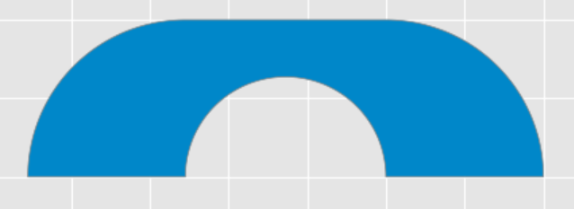

# 
 Software for the Moving Sofa Problem 

Software developed under the mentorship of Professor of Mathematics Dan Romik at the University of California, Davis.
Please click the document titled "An Algorithm for Balancing Sofas" for a complete description of the project. The gif below shows a short run of the algorithm on a low resolution discrete approximation. Keep scrolling to get into the nitty-gritty.

# Abstract

Posed by Leo Moser in 1966, the moving sofa problem remains unsolved. In 1992, Joseph Gerver constructed a sofa which he conjectured to be the optimal solution to Moser's problem. However, Gerver provided no proof of this conjecture and to this date it remains unproven. Making use of Gerver's observations, we develop a variant of Phillip Gibbs' algorithm which provides computational evidence for Gerver's conjecture. We begin the paper by describing how we can approximate solutions to the moving sofa problem using the intersection of a finite number of polygons. Then, we show how we can increase the size of the approximation using Gerver's observations. Finally, we provide a description of the developed algorithm and show that the produced approximation seems to converge in shape and area to Gerver's construction. In the last two sections we briefly describe how to install and use our implementation of the algorithm *sofa_gui.py*. This project was done under the mentorship of Professor Dan Romik at the University of California, Davis.

# A Brief History of the Problem

In 1966, Leo Moser asked the question
>"what is the shape of largest area in the plane that can be moved around a right-angled corner in a two-dimensional hallway of width 1?"

Despite the problem's simple statement, it remains unsolved. Notable points of progess in the problem's history begin in 1968 with the work of John Hammersley who conjectured that his construction (*Figure 1*) of area 2/pi + pi/2 = 2.2074... was optimal. 

