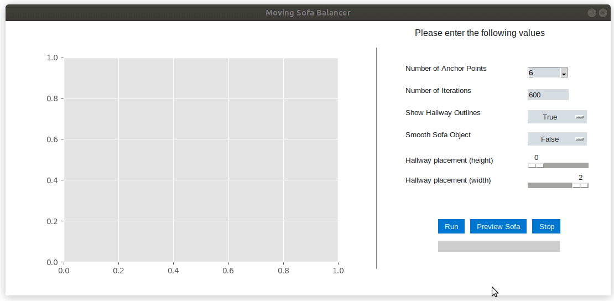

# MovingSofa
Software which provides evidence for Gerver's 1992 conjecture of global optimality.
Please click the document titled "An Algorithm for Balancing Sofas" for pictures and a description of this project.

