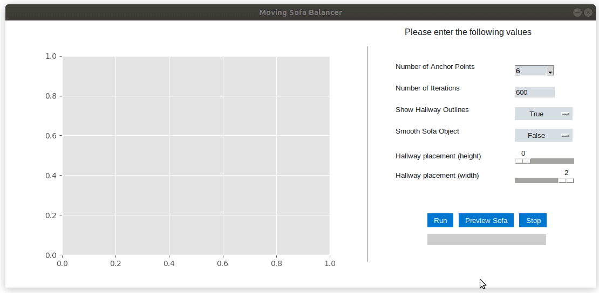

# 
 Software for the Moving Sofa Problem 

Software developed under the mentorship of Professor of Mathematics Dan Romik at the University of California, Davis.
Please click the document titled "An Algorithm for Balancing Sofas" for a complete description of the project. The gif below shows a short run of the algorithm on a low resolution discrete approximation. Keep scrolling to get into the nitty-gritty.

  
Click me to expand another gif! (watch the bottom edge lift up)

  
  
  
   With smoothing on, the algorithm still balances the unsmoothed polygon. This means that the displayed area value can actually decrease as the algorithm interpolates the rotation path with the inner corner of the unsmoothed hallway.
  
  

# (Update) Alternative Hallway Angle Results (sofa_nogui.py) 
As a continuation of my work under the mentorship of professor Dan Romik, but done independently, I have developed <i>sofa_nogui.py</i> to produce hallways for alternate hallway angles. Sofa_gui.py gives a good visual demonstration of the algorithm's behavior for hallways with a 90 degree bend. Sofa_nogui.py can approximate the maximum sofa shape and area for any hallway with a bend of degree 1 to 120 (higher is a tighter turn). This version of the program also uses a more sophisticated termination condition. If the program is left to run it will only stop once it has found the best approximation for the given settings. Below are the results of a 75 degree hallway and a 115 degree hallway. N: denotes the number of anchor points (defined below) placed with the area of the polygon to the left of that. The program uses an unsmoothed version of a discrete approximation to interpolate the rotation path and then constructs a smoothed version accordingly. Because of this, the program will sometimes report that the area of the smoothed approximation is decreasing. This is expected behavior and leads to better approximations.

 
115 degree hallway

75 degree hallway

# Abstract

Posed by Leo Moser in 1966, the moving sofa problem remains unsolved. In 1992, Joseph Gerver constructed a sofa which he conjectured to be the optimal solution to Moser's problem. However, Gerver provided no proof of this conjecture and to this date it remains unproven. Making use of Gerver's observations, we develop a variant of Phillip Gibbs' algorithm which provides computational evidence for Gerver's conjecture. We begin the paper by describing how we can approximate solutions to the moving sofa problem using the intersection of a finite number of polygons. Then, we show how we can increase the size of the approximation using Gerver's observations. Finally, we provide a description of the developed algorithm and show that the produced approximation seems to converge in shape and area to Gerver's construction. In the last two sections we briefly describe how to install and use our implementation of the algorithm *sofa_gui.py*. This project was done under the mentorship of Professor Dan Romik at the University of California, Davis.

# A Brief History of the Problem

In 1966, Leo Moser asked the question
>"what is the shape of largest area in the plane that can be moved around a right-angled corner in a two-dimensional hallway of width 1?"

Despite the problem's simple statement, it remains unsolved. Notable points of progess in the problem's history begin in 1968 with the work of John Hammersley who conjectured that his construction (as seen below) of area 2/pi + pi/2 = 2.2074... was optimal. 

In 1992 came the work of Joseph Gerver who found a valid construction (as seen below) of area 2.2195... which was a modest improvement over Hammersley's construction.

However, Gerver's results were interesting for reasons other than an increase in area over Hammersley's sofa. Derived from considerations of local optimality, Gerver conjectured that his construction was indeed the solution to Moser's 1966 question. Despite the fact that Gerver's construction remains the largest discovered to date, his conjecture of global optimality remains unproven.

# Discrete Approximations
## Notation
We begin by defining the sofa in terms of a rotating coordinate frame. Consider the L-shaped hallway that a candidate sofa moves through as given by

Let R t denote the rotation matrix

Then we let S be a planar shape which satisfies

Where  is a continuous path satisfying *x(0) = (0,0)* which defines the movement of the inner corner of L. As in Romik's 2016 paper, we call *x(t)* the *rotation path*. Only *x(t)* which produces connected shapes will be considered. All S defined in this way will be able to traverse the L-shaped hallway. For simplicity's sake, we can enforce the same restrictions on S by combining the horizontal hallway and the rotated vertical hallway to create one long horizontal hallway. Let

Now define

Consider then, for any given **x(t)** a sampling of **N+1** equidistant nodes. More specifically, call  the set of anchor points which satisfy . For the sake of simplifying notation, let .

We call SN the discrete approximation of S given by 

## Discrete Approximations
One would hope that as N tends towards infinity, SN would tend towards S in area and shape for a fixed rotation path x(t). In absence of a proof, we will show computationally that this appears to be the case for Hammersley's sofa. Hammersley's sofa was chosen for computational simplicity, but the argument should extend to other sofa shapes. 

To illustrate this principle, consider the rotation path x(t) = 2\pi(cos(t)-1,sin(t)) which gives Hammersley's sofa. For N = 2,3,...,256 we generated the corresponding set of anchor points and then built SN. This was done using the function *hallway_set()* which builds a list of elements where the ith element is given by Xi + Ri*(L). Then, the set was passed to the  function *set\_to\_poly()* which intersected every element in the set and returned the resulting polygon. Both of these functions are found in *sofa\_gui.py*.

Then, we calculated the difference between the area of SN and Hammerley's sofa then plotted the results. In addition, we created 'smoothed' versions of SN, denoted by SN*, by doing piecewise linear interpolation between all anchor points to redefine the boundary. The following figures demonstrate the convergence of SN and SN* to Hammersley's sofa. If we let λ(H) be the area of Hammersley's sofa, then figure 4 suggests the following

## Balancing Polygons
Gerver began his 1992 paper by giving the following definition

>Definition: A polygon is *balanced* if, given any side, that side and every
other side parallel to it lies on one of two lines, where the distance between the
lines is 1 and the total length of the sides lying on each of the two lines is
equal. 

The fundamental function of the algorithm is to use Gerver's balanced condition to continually grow the size of an unbalanced discrete sofa. We will now describe mathematically how the discrete sofa is balanced.

*(Due to all of the inline equations in the below proof, an image of the LaTeX rendering has been included. If you have any issues with viewing, I recommend opening the PDF file "An Algorithm for Balancing Sofas" available in this repository.)*

In the next section, a suitable choice for δ becomes clear. 

As illustrated in the above figure, when we translate one of the hallways by a small amount in the direction towards and perpendicular to the largest boundary line in the ’unbalanced pair’ the area we gain is larger than thearea lost.  The algorithm works by continually finding unbalanced pairs and then performing a balancing stepto increase the area of the polygon. As the algorithm continues, the polygon will become 'more balanced' in that the length difference between any two line pairs will begin to be very small.

## Measuring Angles and Finding Delta

Using the function *get\_features()*, details omitted for the sake of brevity, the program chooses an initial line, l1, on the boundary of SN. The line is defined by a set of two points (x1,y1),(x2,y2). The program then measures the angle of the line in the following manner:

The benefit of measuring Θ in such a way is that it allows for easy identification of the corresponding kth hallway hk and makes a suitable choice for δ clear. 

First, we recover the index for the kth hallway by

Before we define δ, we need to clarify how lines are chosen. The program chooses l1 to be the line with the most negative x-coordinate. If the x-coordinates are equal, then the line with the largest y-coordinate is chosen as l1. Then, we define the sgn variable as such

Now we are ready to define δ.

# The Algorithm
## Shapely, Discrete Sofas, and Hallway Sets
The Shapely library provides much of functionality for handling polygons and, performing intersections and transformations throughout the program. Important for understanding the algorithm is understanding the relationship between the discrete sofa SN and the hallway_set variables. In short, the program makes its measurements on the sofa (such as line length, line angles etc) and then manipulates the hallway_set according to the previous measurements. Then, the program generates a new SN by intersecting the elements of the hallway_set.

## Pseudocode
Let SN be a discrete sofa. Let hallway_set be the set of (Xi + Ri*(L)) for i=0,1,...,N-1 where the 0th element is Lstrip. The following pseudocode describes a single iteration of the main function which performs a *balancing operation* which increases the size of SN. The pseudocode assumes that ε was chosen correctly. In the actual implementation of the algorithm, if ε is chosen to be too large the program throws away the results and tries a slightly smaller ε.

# Results
The following two figures show the results of short runs (1000 iterations) of the algorithm for values of N=5 and N=8 respectively and both with smoothing.

The next two figures show the results of slightly longer runs (10-15k iterations) on larger values of N. The shapes quickly become indistringuishable from Gerver's sofa and appear to converge in area.

